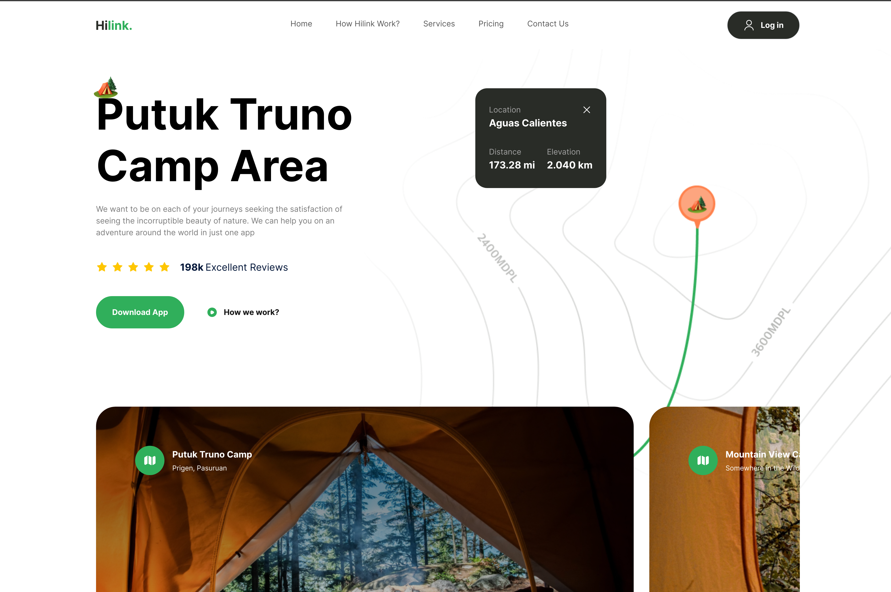

<p align="center">
  
</p>

<p align="center">
  
</p>

<br>

## 🧪 Tecnologias

Esse projeto foi desenvolvido com as seguintes tecnologias:

- [NextJS](https://nextjs.org/)
- [Tailwind CSS](https://tailwindcss.com/)
- [TypeScript](https://www.typescriptlang.org/)

## 💻 Projeto

Um projeto para estudo de como usar UI/UX para criar uma interface de usuário elegante.

## 🚀 Como executar

Clone o projeto e acesse a pasta do mesmo.

```bash
$ git clone https://github.com/CesarNeo/travel-app-ui-ux.git
$ cd travel-app
```

Para iniciá-lo, siga os passos abaixo:

```bash
# Instalar as dependências
$ npm install

# Iniciar o projeto
$ npm run dev
```

O app estará disponível no seu browser pelo endereço http://localhost:3000.
